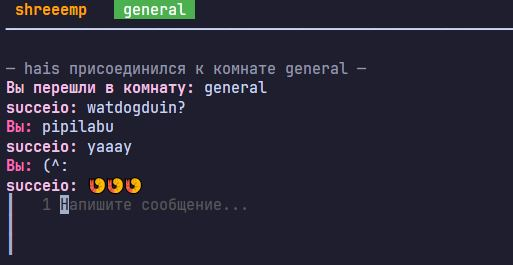
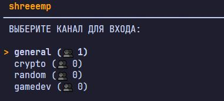

#### Shreeemp Chat 👥

Терминальный чат-клиент на Go с поддержкой комнат и скроллинга.
Go + TLS + Bubble Tea v2

#### Клиент и сервер
В зависимости от переданных флагов, будет запущен клиент или сервер.

#### Режим разработки
##### docker compose up --build
##### go run main.go -mode=client

#### Продуктовое (не проверял)
На сервере положить ключ и сертификат в /certs.
#### Запуск клиента на продуктовый адрес
go run main.go -mode=client -host=95.213.x.x -port=8443
